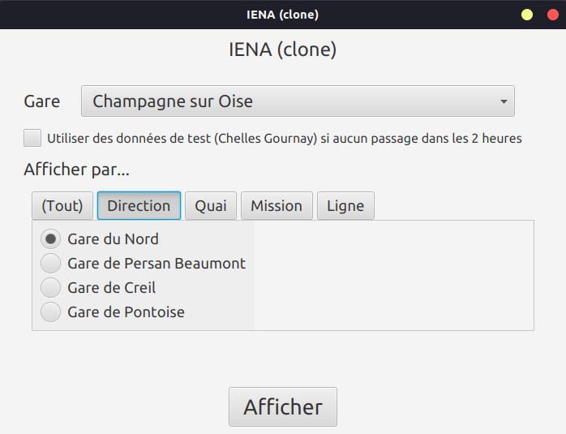

# iena-clone

Début d'implémentation d'un clone de l'actuel système d'information voyageurs de la SNCF pour les lignes de train Transillien nommé IENA, en Java.

Pour lancer l'application, se placer à la racine du dépôt, puis exécuter la commande `./gradlew run`.

Pour le moment, les résultats s'affichent uniquement dans le terminal.

## Accès aux données d'Île-de-France Mobilité

Pour pouvoir récupérer les données de l'API d'Île-de-France Mobilité (nommée PRIM), vous devez initialiser une variable d'environnement nommée `prim_api`
dans votre terminal, ayant pour valeur votre propre clé d'API obtenue en créant un compte sur le site de [PRIM](https://prim.iledefrance-mobilites.fr),
puis en allant dans [cette section](https://prim.iledefrance-mobilites.fr/fr/mes-jetons-authentification). 

Sinon, vous pouvez toujours tester le logiciel avec des données de test pré-chargées, sélectionnable depuis le tableau de bord (voir section suivante).

## Exemple de présentation du tableau de bord

## Exemple de présentation de l'afficheur

[(voir README.md de la branche "display")](https://github.com/neufdegres/iena-clone/tree/display?tab=readme-ov-file#exemple-de-pr%C3%A9sentation-de-lafficheur)
