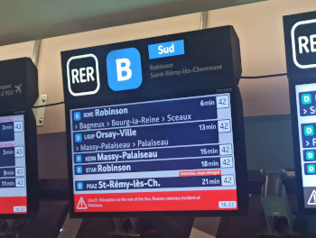
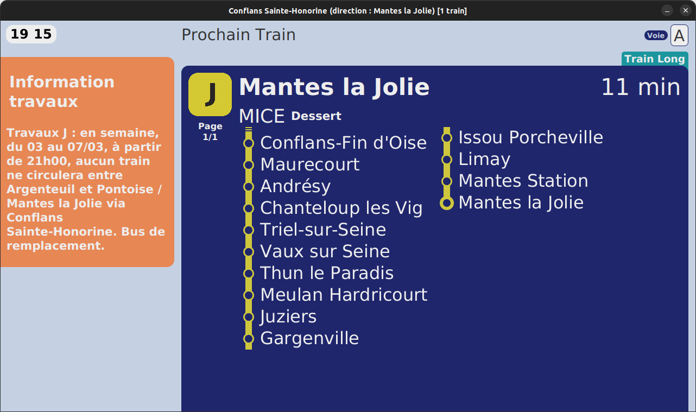

# iena-clone

Implémentation d'un clone de l'actuel système d'information voyageurs en gare de la SNCF pour les lignes de train Transillien nommé IENA, en Java, à l'aide de la bibliothèque graphique JavaFX.

Pour lancer l'application, se placer à la **racine du dépôt**, puis exécuter la commande `./gradlew run`.

## Dépendances

- Java 21 minimum.

## Accès aux données d'Île-de-France Mobilité

Pour pouvoir récupérer les données des APIs de la plateforme d'Île-de-France Mobilité (nommée PRIM), vous devenez gérérer une clé personnelle d'API sur en créant un compte sur le site de [PRIM](https://prim.iledefrance-mobilites.fr), puis en allant dans [cette section](https://prim.iledefrance-mobilites.fr/fr/mes-jetons-authentification).

Ensuite, pour pouvoir l'utilser dans ce logiciel vous devez soit :

- enregistrer dans votre terminal une variable d'environnement nommée `prim_api`, ayant pour valeur votre propre clé d'API;
- ou alors modifier le fichier [api_key.txt](api_key.txt) situé à la racine du projet.

Sinon, vous pouvez toujours tester le logiciel avec des données pré-chargées, sélectionnable depuis le tableau de bord (voir section suivante). L'afficheur ne sera cependant pas actualisé automatiquement.

## Exemple de présentation du tableau de bord

## Exemple de présentation de l'afficheur

Il a 3 types d'afficheurs disponibles en gares SNCF :

|No| Type d'afficheur | Image |
|--|------------------|-------|
|01|affiche le prochain train à venir *au quai où il est placé*||
|02|affiche les 3 prochains trains à venir *au quai où il est placé*||
|03|affiche 5 prochains passages (souvent situé en dehors des quais)||

Actuellement, uniquement le premier type est implémenté.

### Clone

Voici un exemple d'afficheur généré par le logiciel.

## Comment utiliser l'application

Au démarage, la liste des arrêts de trains disponibles est chargée.

Après avoir choisi une gare, si vous avez une connexion internet et si vous avez bien enregistré votre clé d'API ([voir 1e section](#accès-aux-données-dîle-de-france-mobilité)), les données des prochains passages en gares sont préchagés et, *si il en a*, sont filtrés.

Vous pouvez à présent choisir le filtre voulu.

Ensuite, il vous est demandé le type d'affichage ([voir section précédente](#exemple-de-présentation-de-lafficheur)).

Vous pouvez maintenant cliquer sur le bouton pour afficher l'afficheur généré.

### Important

- Il peut avoir des bugs d'affichage sur Windows, préférer donc lancer le logiciel sur une distribution **Linux**.
- Vous pouvez générer plusieurs afficheurs (avec des filtres différents ou non) de la même gare. Si vous vous en générer un d'une autre gare, tous les afficheurs actuellement ouverts se ferment.
- Seules les gares traversées par les lignes SNCF d'Ile-de-France, soit les **lignes RER C, D et E**, ainsi que les **Transilliens (H,J,K,L,N,P,R,U)**, sont disponibles.
- Pour les quelques passages des lignes **RATP (RER A & B)** affichables dans l'applications (dans les gares partagées avec d'autres lignes dans leurs trançons SNCF respectifs (ex: Mitry-Claye, Poissy)), leurs parcours peuvent ne pas être affichés correctement.
- Les passages TER ne sont pas disponibles *pour le moment*.
- Les annonces ne sont pas encore implémentée.
- Evitez de tester le logiciel entre 1h et 4h du matin, il n'y a pas (ou peu) de passages enregistrés dans l'API de PRIM.
